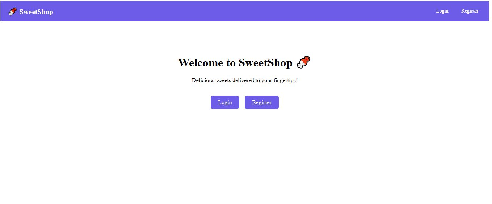
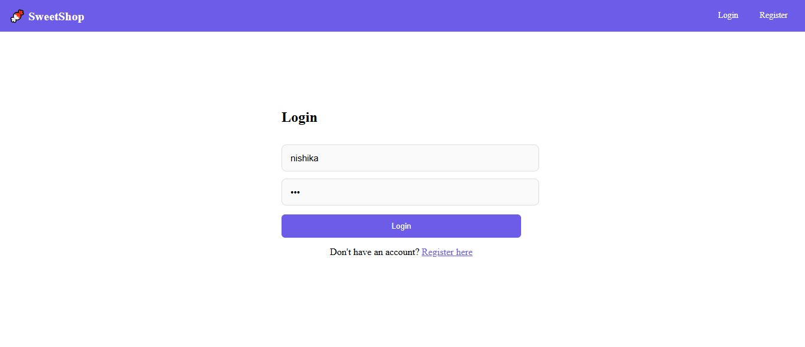
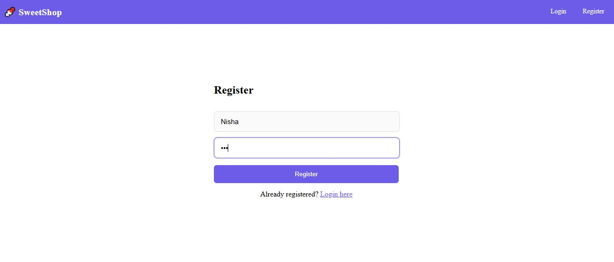
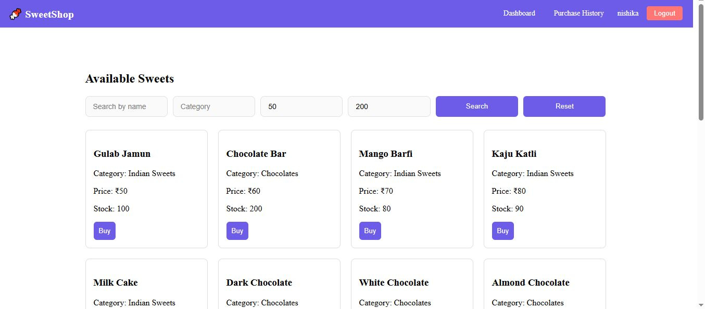
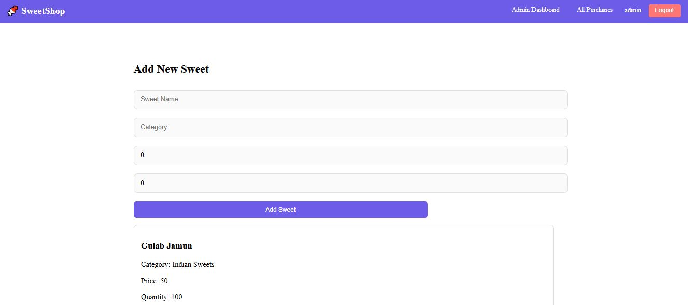
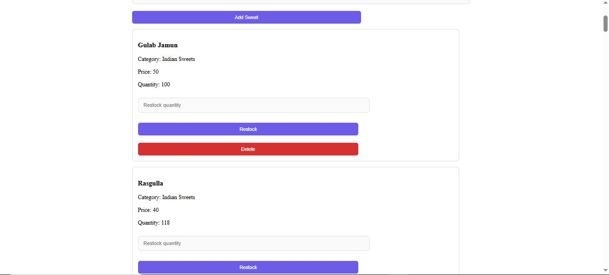
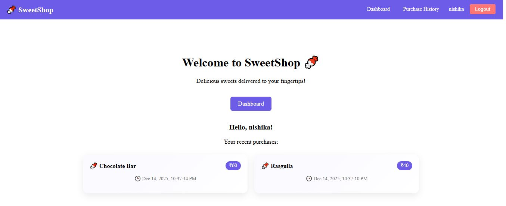
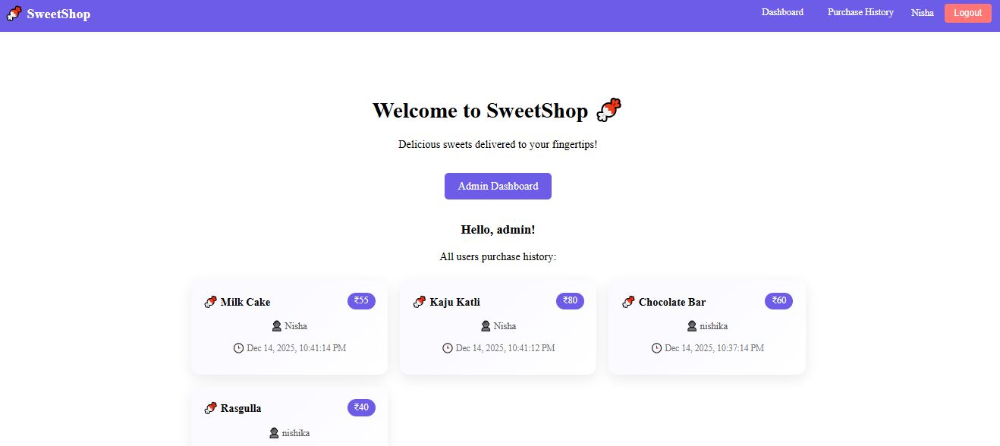
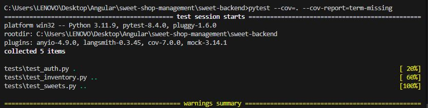
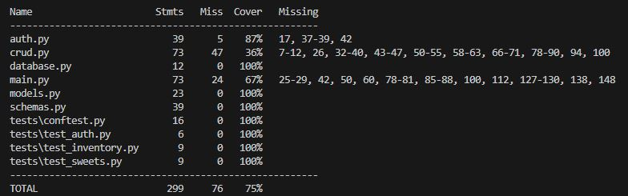

<!-- # SweetShopManagement

This project was generated with [Angular CLI](https://github.com/angular/angular-cli) version 16.2.11.

## Development server

Run `ng serve` for a dev server. Navigate to `http://localhost:4200/`. The application will automatically reload if you change any of the source files.

## Code scaffolding

Run `ng generate component component-name` to generate a new component. You can also use `ng generate directive|pipe|service|class|guard|interface|enum|module`.

## Build

Run `ng build` to build the project. The build artifacts will be stored in the `dist/` directory.

## Running unit tests

Run `ng test` to execute the unit tests via [Karma](https://karma-runner.github.io).

## Running end-to-end tests

Run `ng e2e` to execute the end-to-end tests via a platform of your choice. To use this command, you need to first add a package that implements end-to-end testing capabilities.

## Further help

To get more help on the Angular CLI use `ng help` or go check out the [Angular CLI Overview and Command Reference](https://angular.io/cli) page.

 -->


 # Sweet Shop Management System


<!-- TABLE OF CONTENTS -->

## Table of Contents

* [About The Project](#about-the-project)
* [Features](#features)
* [Tech Stack](#tech-stack)
* [Project Architecture](#project-architecture)
* [Getting Started](#getting-started)
* [Prerequisites](#prerequisites)
* [Installation](#installation)
* [Usage](#usage)
* [API Endpoints](#api-endpoints)
* [Screens & Modules](#screens--modules)
* [Application Pages Overview](#application-pages-overview)
* [Testing & TDD (Backend)](#testing-and-tdd)


<!-- ABOUT THE PROJECT -->

## About The Project

**SweetShop Management System** is a full‑stack web application designed to manage an online sweet shop. The system supports **user and admin roles**, secure authentication using **JWT**, sweet inventory management, purchasing, restocking, and purchase history tracking.

The project demonstrates real‑world implementation of:

* Role‑based access control (Admin vs User)
* RESTful API design
* Angular + FastAPI integration
* Secure authentication & authorization

<!-- FEATURES -->

## Features

### 👤 User Features

* User registration & login
* JWT‑based authentication
* Browse available sweets
* Search sweets by name, category, and price range
* Purchase sweets
* View personal purchase history

### 🛠️ Admin Features

* Admin login
* Add new sweets
* Update sweet details
* Delete sweets
* Restock sweets
* View all users’ purchase history

### 🔐 Security Features

* Password hashing using **Passlib**
* JWT token authentication
* Route protection using Angular Guards
* Backend admin‑only API protection

<!-- TECH STACK -->

## Tech Stack

### Frontend

* **Angular**
* TypeScript
* HTML & CSS
* Angular Router
* HTTP Interceptors

### Backend

* **FastAPI**
* Python
* SQLAlchemy ORM
* JWT (python‑jose)
* Passlib (Password Hashing)

### Database

* **SQLite**

<!-- ARCHITECTURE -->

## Project Architecture

```
Frontend (Angular)
│
├── Components (Home, Login, Register, Dashboard, Admin)
├── Services (AuthService, SweetService)
├── Guards (authGuard)
├── Interceptors (TokenInterceptor)
│
Backend (FastAPI)
│
├── main.py        → API entry point
├── auth.py        → Authentication & JWT
├── crud.py        → Database operations
├── models.py      → SQLAlchemy models
├── schemas.py     → Pydantic schemas
├── database.py    → DB configuration
```

<!-- GETTING STARTED -->

## Getting Started

Follow the steps below to run the project locally.

<!-- PREREQUISITES -->

## Prerequisites

Make sure you have the following installed:

* Node.js & npm
* Angular CLI
* Python 3.9+
* pip

<!-- INSTALLATION -->

## Installation

### 1. Clone the Repository

```sh
git clone https://github.com/Nishika-Ahuja/Sweet-Shop-Management-System.git
```

---

### 2. Backend Setup (FastAPI)

```sh
cd backend
pip install -r requirements.txt
uvicorn main:app --reload
```

Backend will run at:

```
http://127.0.0.1:8000
```

---

### 3. Frontend Setup (Angular)

```sh
npm install
ng serve
```

Frontend will run at:

```
http://localhost:4200
```

<!-- USAGE -->

## Usage

* Register as a user
* Login to access dashboard
* Admin credentials (auto‑created):

  * **Username:** admin
  * **Password:** admin123

Admins can manage sweets, restock inventory, and monitor purchases.

<!-- API ENDPOINTS -->

## API Endpoints

### Authentication

* `POST /api/auth/register`
* `POST /api/auth/login`

### Sweets

* `GET /api/sweets`
* `POST /api/sweets` (Admin)
* `PUT /api/sweets/{id}` (Admin)
* `DELETE /api/sweets/{id}` (Admin)
* `POST /api/sweets/{id}/purchase`
* `POST /api/sweets/{id}/restock` (Admin)
* `GET /api/sweets/search`

### Purchases

* `GET /api/users/me/purchases`
* `GET /api/admin/purchases` (Admin)

<!-- SCREENS -->

## Screens & Modules

* Home Page
* Login & Register
* User Dashboard
* Admin Dashboard
* User Purchase History
* Admin Purchase History showing all users' purchase records
* Navbar with role‑based options

---
## Application Pages Overview

This section describes the main pages of the **SweetShop Management System** along with their purpose and functionality.

---

### Home Page


The Home Page serves as the landing page of the application.  
It displays a welcome message and dynamically shows navigation options based on the user’s authentication status:
- Guest users can access **Login** and **Register**
- Logged-in users are redirected to their respective dashboards
- Admin users are redirected to the **Admin Dashboard**

---

### Login & Register



This page allows users to create a new account or log in to an existing one.
- Secure authentication using **JWT**
- User role (Admin / User) is determined after login
- Successful login redirects users to their appropriate dashboard

---

### User Dashboard


The User Dashboard displays all available sweets in the shop.
- View sweet name, category, price, and stock
- Search sweets by name, category, and price range
- Purchase sweets if stock is available
- Automatically updates inventory after purchase

---

### Admin Dashboard



The Admin Dashboard provides full control over the sweet inventory.
- Add new sweets
- Update sweet details
- Delete sweets
- Restock existing sweets
- Restricted access using admin-only authorization

---

### User Purchase History


This page shows the purchase history of the currently logged-in user.
- Displays purchased sweet name, price, and purchase date
- Sorted by most recent purchases
- Accessible only to authenticated users

---

### Admin Purchase History


This page allows administrators to view purchase records of all users.
- Displays username, sweet name, price, and purchase date
- Helps admins track overall sales and user activity
- Restricted to admin users only

---

## Testing and TDD

The **Sweet Shop Management System** backend is developed following **Test-Driven Development (TDD)** principles.  

### TDD Approach

1. **Red → Green → Refactor**
   * **Red**: Write a failing test first for a feature.
   * **Green**: Implement functionality to make the test pass.
   * **Refactor**: Clean the code while keeping tests green.

2. **Tools**
   * **Pytest** – for writing and running Python tests.
   * **FastAPI TestClient** – simulates API requests for testing endpoints.
   * **SQLite** – used as the test database for isolated test runs.

3. **Fixtures**
   * `user_token` – Provides JWT token for a normal user.
   * `admin_token` – Provides JWT token for an admin user.

4. **Tested Features**
   | Feature | Test File | Description |
   |---------|-----------|-------------|
   | User Registration & Login | `tests/test_auth.py` | Tests creating users and login functionality. |
   | Admin Sweet Management | `tests/test_sweets.py` | Tests admin adding sweets and verifies user restrictions (403). |
   | Sweet Purchase | `tests/test_inventory.py` | Tests purchasing sweets, including out-of-stock cases. |

5. **Running Tests**

```bash
pytest --cov=. --cov-report=term-missing
```
The command runs all tests and generates coverage report.

